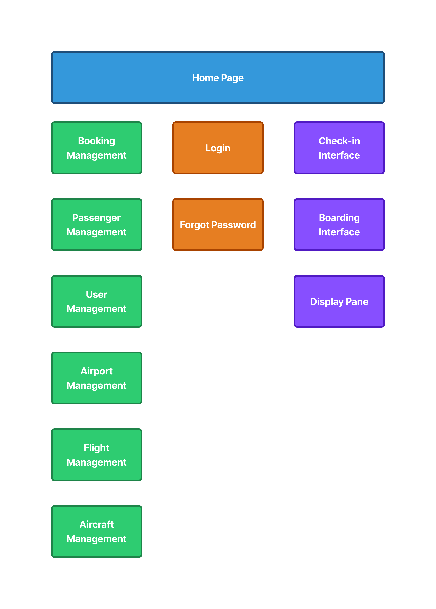

# Domestic Airlines Management System
A management system for the Domestic Airlines, a web project for the web development course in ENSIA second year. 

The Domestic Airlines Internal Management System is a secure web platform designed for company employees to manage daily operations such as passenger check-in, flight scheduling, airport logistics, and staff coordination. Targeted at airline staff aged 22–60 working mainly in urban airports and offices, the site is used daily on desktop devices for essential professional tasks. Its purpose is to centralize operations, improve efficiency, ensure real-time updates, and facilitate communication between departments through a user-friendly interface with role-based access control and secure authentication.

## Sitemap

## Assignement of tasks

| Name  | Tasks |
|-------|------|
| Raouf | Homepage, Display Pane, Airport Management |
| Zakaria | Booking Management, Passenger Management, Forgot Password |
| Anis | Login, Aircraft Management, User |
| Anes | Boarding, Check-in, Flight Management |